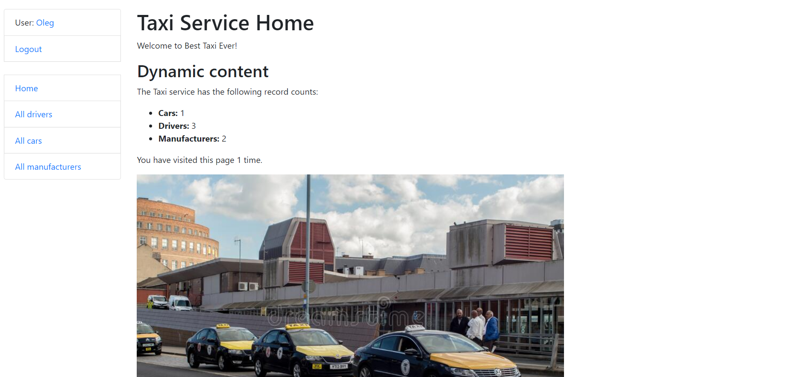
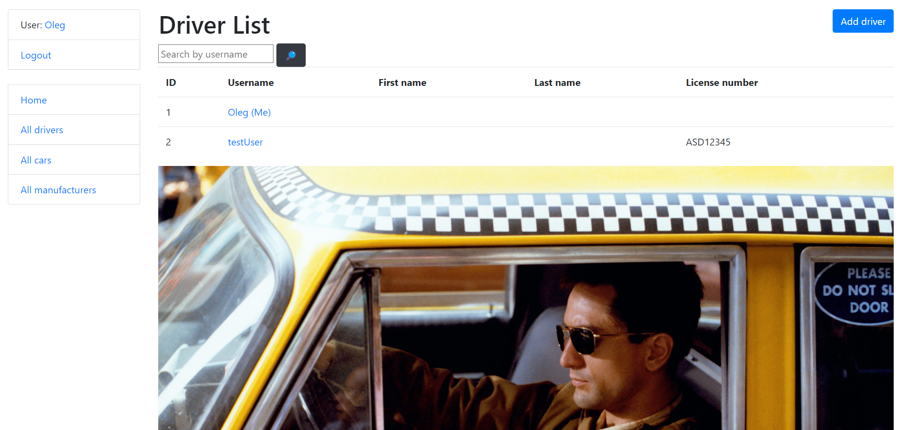

Taxi Service
=
Django taxi service project for managing cars, manufacturers and drivers.

## Check it out!
Taxi service deployed to Heroku(http://taxi-service-tdp1.herokuapp.com/)

`username: user  password: user12345`

Installing / Getting started
Python 3 must be already installed

```git clone https://github.com/Chardona/Taxi-deploy.git
cd taxi-service
python -m venv venv
venv/scripts/activate
pip install -r requirements.txt
python manage.py runserver  # starts Django project
```

Features
+ Authentication functionality for Driver/User
+ Managing drivers, cars, manufacturers directly from website
+ Powerful admin panel for advanced managing

Demo



